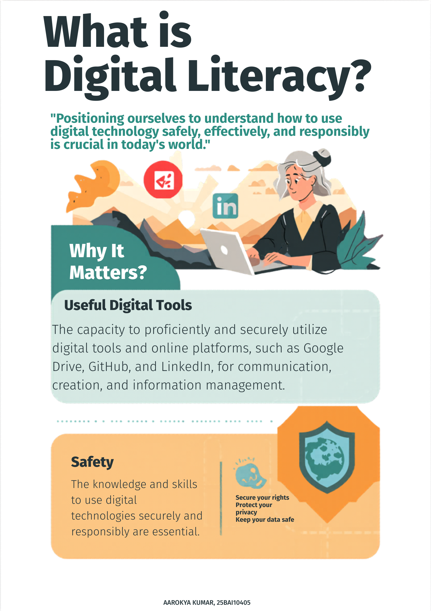

# 📘 Digital Literacy Project

## 👤 Student Details
- **Name:** Aarokya Kumar
- **Registration Number:** 25BAI10405  
- **Branch:** CSE (AI & ML)  
- **Year:** 1st Year  

---

## 📌 Project Overview
This project is a Digital Literacy Portfolio created as part of the Digital Literacy course. It covers various aspects of digital awareness including online safety, professional presence, coding platforms, communication etiquette, and cybercrime awareness. The aim is to develop essential digital skills required for academic and professional growth.

---

## 🧩 Task Summaries

### 🔹 Task 1: Digital Literacy Infographic
Created a one-page infographic using Canva explaining the concept of digital literacy, its importance, useful tools, and safe online practices.

---

### 🔹 Task 2: Digital Portfolio
Created and updated profiles on:
- GitHub  
- LinkedIn  
- Kaggle  

These platforms help in building a professional online presence and showcasing skills.

---

### 🔹 Task 3: Platforms Exploration
- Completed a beginner coding problem on HackerRank  
- Created a Google Form quiz on Digital Literacy  

🔗 **Google Form Link:**  
[https://docs.google.com/forms/d/e/1FAIpQLScHHtcYKxRVLty4RXDZHPUJr4dYsICcnjj09NSLumE4BtNqFA/viewform?usp=publish-editor]

---

### 🔹 Task 4: Email Etiquette
Drafted professional emails and created a checklist for responsible social media usage.

---

### 🔹 Task 5: Cybercrime Awareness
Prepared a case study on cybercrime and created a prevention checklist for safe online practices.

---

